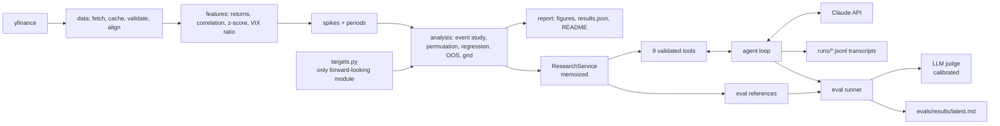

# VIX Research Agent

Do spikes in cross-asset correlation lead spikes in the VIX? A preregistered test on
2007 to 2026 market data, plus an LLM research agent that can only answer by calling
the tested pipeline, measured by a 24-case eval harness.

## Background

This extends [a paper I co-authored](https://www.advisorperspectives.com/articles/2025/10/06/what-signals-market-vix-blow-up) about what signals a coming market blowup: in a panic, unrelated assets start moving together because everyone sells out of fear instead of judging each asset individually. A first version of this repo tested that idea on a basket of 10 unrelated large-cap stocks from 2015 onward, using cross-correlation, Granger causality, and a simple event study. It found that correlation and the VIX clearly move together, but not that correlation leads; if anything, the VIX moved slightly first. That version is preserved in the git history.

This version rebuilds the test to address that version's weaknesses: a cross-asset ETF universe (equities, high yield, Treasuries, investment-grade credit, gold) back to 2007, a preregistered primary test, declustered events, permutation p-values, a train/test split, and automated checks against lookahead bias.


## Result
<!-- RESULTS:START -->
**Headline.** Preregistered test (risk group, 21-day window, z >= 2.0, 10-day horizon, clean events): on the 2019-01-01 to 2026-06-30 test period, 2 correlation events had a VIX-spike hit rate of 0.0% vs a base rate of 18.8% (lift 0.00, permutation p = 1.000). Too few events for a reliable test.

**Reverse direction** (VIX events followed by correlation spikes, test period): 24 events, lift 0.00, p = 1.000.

**Out-of-sample R^2** of the correlation z-score regression: 0.0210.

Full tables: [reports/results.md](reports/results.md).
<!-- RESULTS:END -->

## Why this is hard

**Lookahead bias.** A feature that quietly uses future data, like a z-score standardized with full-sample statistics, makes any predictor look better than it could ever be in real time. Every baseline here is built from past data only (`shift(1)` before rolling statistics), and forward-looking code is confined to a single module, `targets.py`. An automated test recomputes every feature on data truncated at random dates and fails if any earlier value changes; a companion test proves it catches a deliberately leaky z-score.

**Clustered events.** A crisis produces a run of consecutive spike days that are really one episode, and counting each one inflates the sample and fakes significance. Spike days are declustered into events with a cooldown, and p-values come from a circular-shift permutation test that slides the whole event pattern along the timeline, preserving how clumpy real market events are instead of assuming independence like a t-test.

**Multiple testing.** Trying many parameter combinations guarantees that one looks good by luck. The primary specification was written down and committed (git tag `prereg-freeze`) before any results were computed, and it is the headline no matter what. The full exploratory grid is reported separately, along with an overfitting check that picks the best in-sample combination and shows how it holds up on the untouched test period.

## Architecture



## Quickstart

```bash
git clone https://github.com/ajeetb123/market-correlation-vix.git
cd market-correlation-vix
python3.11 -m venv .venv && source .venv/bin/activate   # any Python 3.11+
pip install -e ".[dev]"
cp .env.example .env        # add your ANTHROPIC_API_KEY
vixagent pull               # download and cache data
vixagent report             # figures + results
vixagent chat --show-tools  # talk to the research agent
vixagent eval               # run the eval suite
```

## Example: the agent pushing back

<!-- Abridged real transcript from runs/*.jsonl goes here (docs/steps/phase-5-polish.md, Step 5.3). -->

## Eval results
<!-- EVALS:START -->
Evals not yet run.
<!-- EVALS:END -->

What the evals do and do not test: the evals measure whether the agent uses the pipeline faithfully (every number grounded in a tool output, correct values, the right tools called, and pushback on false premises, lookahead, and overfitting). They do not test whether the pipeline itself is correct, because the agent and the reference answers call the same analysis code; that is covered by the pytest suite (synthetic data with known answers, the hand-checkable event study, and the no-lookahead test).

## Limitations

- Single data source: all prices come from Yahoo Finance via yfinance.
- Daily closing data only; intraday dynamics are not captured.
- The VIX spike threshold (ratio >= 1.30 vs the prior 20-day median) is a modeling choice.
- 24 grid combinations were tested, so exploratory results face multiple-testing risk.
- Correlation spikes and VIX spikes can share a common cause; a lead is not causation.
- Results are not a trading strategy and are not investment advice.

## What I learned
<!-- Written by Ajeet. -->

## Repository map

```
config/            settings.yaml and the frozen preregistered.yaml
src/vixagent/
  data/            yfinance fetch, parquet cache, validation, alignment
  features/        log returns, rolling correlation, trailing z-score, VIX features
  targets.py       the only forward-looking module
  spikes.py        spike days and declustered events
  analysis/        event study, permutation test, regression, out-of-sample, grid
  report/          figures, results.json/.md, README injection
  agent/           research service, tools, system prompt, tool-use loop, transcripts
  evals/           case loader, references, graders, LLM judge, runner
  cli.py           vixagent pull | report | ask | chat | eval
tests/             pytest suite (synthetic data, fake Anthropic client, no network)
evals/             24 eval cases, judge calibration set, changelog, latest results
reports/           generated figures and results (committed)
docs/              spec, plan, step-by-step phase guides, walkthroughs
```
