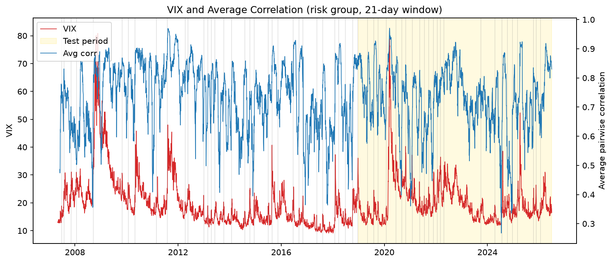
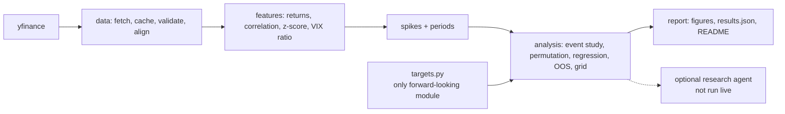

# Market Correlation vs. VIX

Do spikes in cross-asset correlation lead spikes in the VIX? A preregistered test on
2007 to 2026 market data, built so that it is hard to fool yourself: the primary test
was locked in before any results existed, and automated checks guard against lookahead bias.

## In short

I tested whether assets moving together predicts market fear spikes, using a locked-in test
and safeguards against lookahead bias. The answer was no: they happen at the same time, not
one before the other. When the data hinted at a different pattern, I locked that in as a new
hypothesis and tested it on untouched data from 1999 to 2007. It didn't hold up, and I report
that too.

## Background

This extends [a paper I co-authored](https://www.advisorperspectives.com/articles/2025/10/06/what-signals-market-vix-blow-up) about what signals a coming market blowup: in a panic, unrelated assets start moving together because everyone sells out of fear instead of judging each asset individually. A first version of this repo tested that idea on a basket of 10 unrelated large-cap stocks from 2015 onward, using cross-correlation, Granger causality, and a simple event study. It found that correlation and the VIX clearly move together, but not that correlation leads; if anything, the VIX moved slightly first. That version is preserved in the git history.

This version rebuilds the test to address that version's weaknesses: a cross-asset ETF universe (equities, high yield, Treasuries, investment-grade credit, gold) back to 2007, a preregistered primary test, declustered events, permutation p-values, a train/test split, and automated checks against lookahead bias.



## Result
<!-- RESULTS:START -->
**Headline.** Preregistered test (risk group, 21-day window, z >= 2.0, 10-day horizon, clean events): on the 2019-01-01 to 2026-06-30 test period, 2 correlation events had a VIX-spike hit rate of 0.0% vs a base rate of 18.8% (lift 0.00, permutation p = 1.000). Too few events for a reliable test.

**Reverse direction** (VIX events followed by correlation spikes, test period): 24 events, lift 0.00, p = 1.000.

**Out-of-sample R^2** of the correlation z-score regression: 0.0210.

Full tables: [reports/results.md](reports/results.md).
<!-- RESULTS:END -->

## Follow-up study

The original test found a hint of the reverse pattern: high correlation was followed by the VIX
*falling*, even after accounting for the VIX's own recent move. Because that idea came from the
same data, it was preregistered as a new hypothesis (git tag `followup-prereg-freeze`) and tested
once on data the project had never analyzed: nine US sector ETFs from 1998 to 2007.

<!-- FOLLOWUP:START -->
Follow-up test (sector ETFs, 21-day window, 10-day horizon, with VIX momentum and level controls): on the untouched 1998-12-22 to 2007-04-30 holdout, the coefficient on the correlation z-score was -0.0078 (HAC t = -1.26, one-sided p = 0.1038, n = 1816). Not supported at alpha = 0.05.

Details: [reports/followup.md](reports/followup.md).
<!-- FOLLOWUP:END -->

## Why this is hard

**Lookahead bias.** A feature that quietly uses future data, like a z-score standardized with full-sample statistics, makes any predictor look better than it could ever be in real time. Every baseline here is built from past data only (`shift(1)` before rolling statistics), and forward-looking code is confined to a single module, `targets.py`. An automated test recomputes every feature on data truncated at random dates and fails if any earlier value changes; a companion test proves it catches a deliberately leaky z-score.

**Clustered events.** A crisis produces a run of consecutive spike days that are really one episode, and counting each one inflates the sample and fakes significance. Spike days are declustered into events with a cooldown, and p-values come from a circular-shift permutation test that slides the whole event pattern along the timeline, preserving how clumpy real market events are instead of assuming independence like a t-test.

**Multiple testing.** Trying many parameter combinations guarantees that one looks good by luck. The primary specification was written down and committed (git tag `prereg-freeze`) before any results were computed, and it is the headline no matter what. The full exploratory grid is reported separately, along with an overfitting check that picks the best in-sample combination and shows how it holds up on the untouched test period.

## Architecture



## Quickstart

Everything below is free: it uses public Yahoo Finance data and runs locally.

```bash
git clone https://github.com/ajeetb123/market-correlation-vix.git
cd market-correlation-vix
python3.11 -m venv .venv && source .venv/bin/activate   # any Python 3.11+
pip install -e ".[dev]"
pytest -q                   # full test suite, no network needed
vixagent pull               # download and cache data
vixagent report             # figures + results
```

## Optional: research agent

The repo also contains a research agent: Claude answering questions about the study only by calling the tested pipeline as tools, plus an eval harness (grounding, numeric, tool-use, and LLM-judge graders over a set of test questions) that checks it does not invent numbers and pushes back on flawed premises. It is fully built and unit-tested against a fake API client, but it has not been run live, because that requires a paid Anthropic API key. To try it, copy `.env.example` to `.env`, add a key, and run `vixagent chat --show-tools` or `vixagent eval`.

## Limitations

- Single data source: all prices come from Yahoo Finance via yfinance.
- Daily closing data only; intraday dynamics are not captured.
- The VIX spike threshold (ratio >= 1.30 vs the prior 20-day median) is a modeling choice.
- 24 grid combinations were tested, so exploratory results face multiple-testing risk.
- Correlation spikes and VIX spikes can share a common cause; a lead is not causation.
- Results are not a trading strategy and are not investment advice.

## Repository map

```
config/            settings.yaml and the frozen preregistered.yaml
src/vixagent/
  data/            yfinance fetch, parquet cache, validation, alignment
  features/        log returns, rolling correlation, trailing z-score, VIX features
  targets.py       the only forward-looking module
  spikes.py        spike days and declustered events
  analysis/        event study, permutation test, regression, out-of-sample, grid
  report/          figures, results.json/.md, README injection
  agent/           optional research agent: service, tools, prompt, loop, transcripts
  evals/           optional agent evals: cases, references, graders, judge, runner
  cli.py           vixagent pull | report | ask | chat | eval
tests/             pytest suite (synthetic data, fake API client, no network)
reports/           generated figures and results (committed)
docs/              spec, plan, step-by-step phase guides, walkthroughs
```
