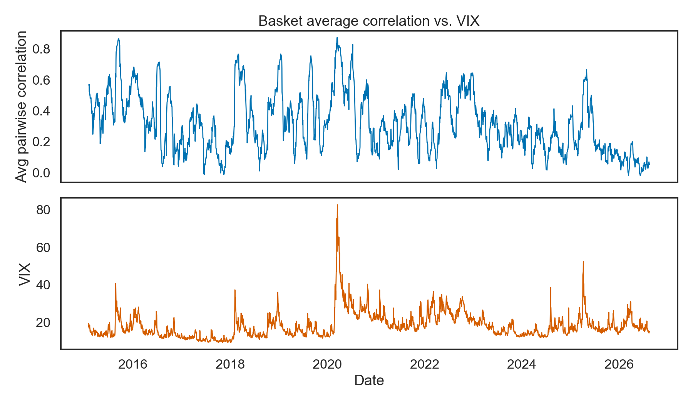
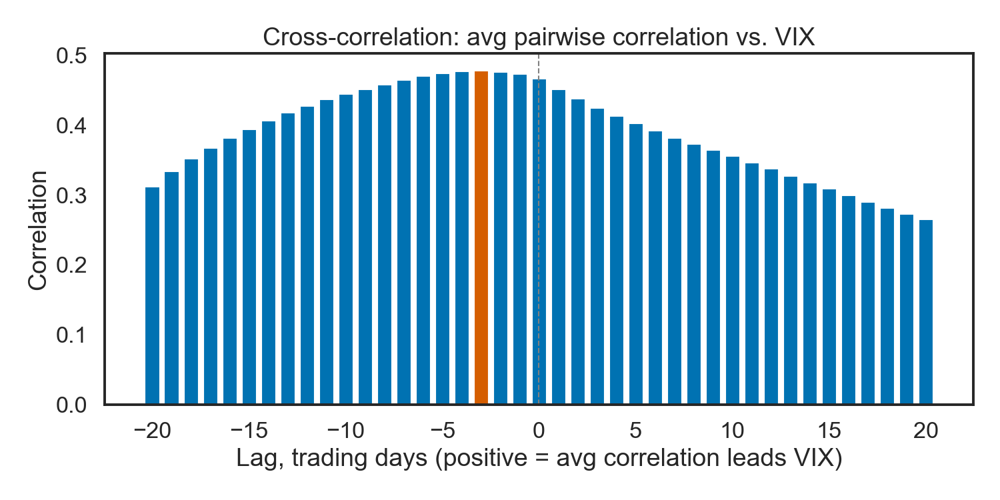
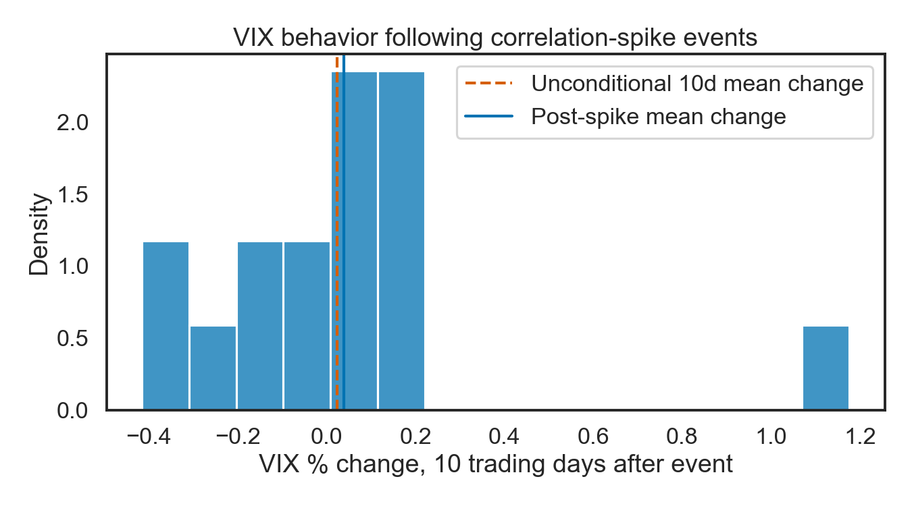
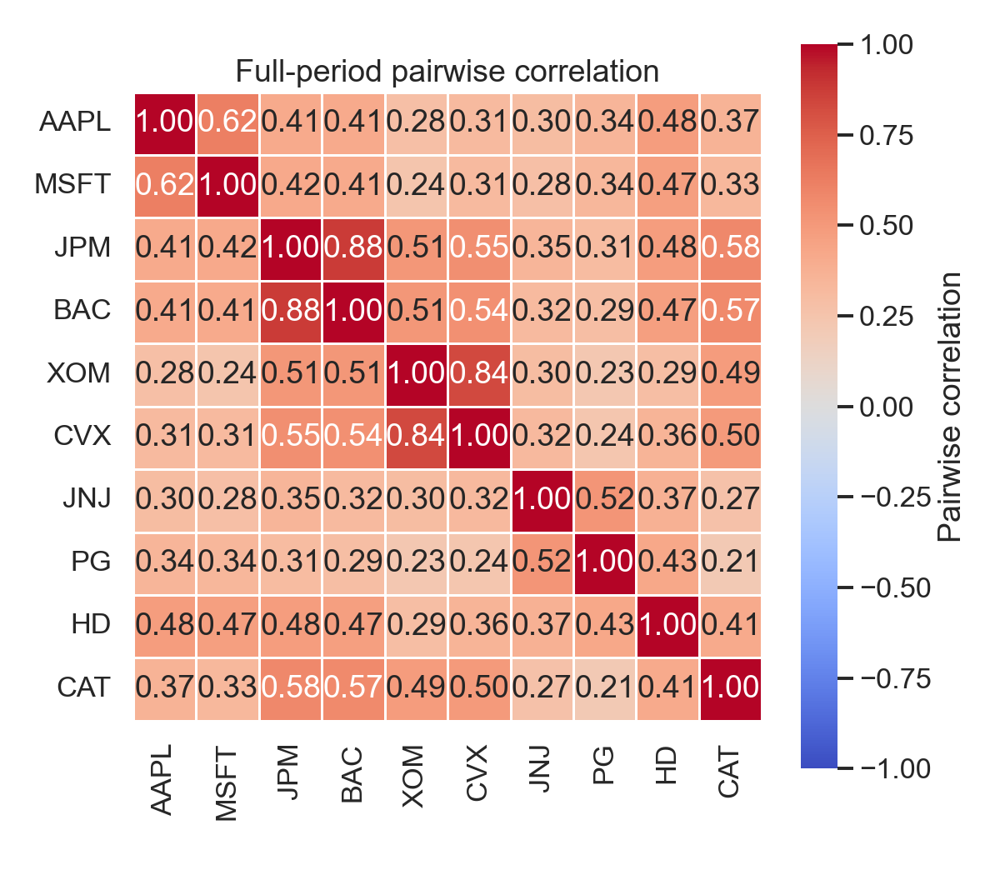

# Market Correlation vs. VIX

A Python rebuild of an Excel-based research project: does a breakdown in
diversification across a basket of stocks — i.e., a spike in how correlated
they all are with each other — tend to *lead* a spike in the VIX, or are the
two more or less contemporaneous?

## Hypothesis

In normal markets, different companies' stock prices move for their own
reasons: an earnings beat here, an oil price move there, a product recall
somewhere else. Diversification works because those reasons are mostly
independent, so a basket of unrelated names shouldn't move in lockstep.

During market-wide stress, that breaks down. Investors stop differentiating
between individual names and sell (or buy) everything together, driven by a
single macro factor — this is the "correlations go to 1 in a crisis" effect.
The VIX, meanwhile, is a forward-looking measure of expected S&P 500
volatility derived from options prices.

The hypothesis this project tests: **a rise in average pairwise correlation
across a diversified stock basket is an early signal of rising fear, and
tends to precede — not just coincide with — a spike in the VIX.** If true,
average correlation would be a useful leading indicator. If the two series
are simply contemporaneous (or correlation *lags* VIX), that's a much weaker
and less useful result.

## Data

- **Basket** — 10 large-cap U.S. stocks spread across 5 sectors, so the
  basket's average correlation reflects market-wide co-movement rather than
  one sector's story: `AAPL`/`MSFT` (Technology), `JPM`/`BAC` (Financials),
  `XOM`/`CVX` (Energy), `JNJ`/`PG` (Healthcare/Staples), `HD`/`CAT`
  (Discretionary/Industrials).
- **VIX** — `^VIX`, the CBOE Volatility Index.
- **Source** — [yfinance](https://github.com/ranaroussi/yfinance), daily
  split/dividend-adjusted closes, 2015-01-01 to present.

## Method

1. **[`src/data.py`](src/data.py)** downloads adjusted daily closes for the
   basket and the VIX and aligns them to a common trading calendar.
2. **[`src/correlation.py`](src/correlation.py)** computes daily returns,
   then a rolling 20-trading-day (~1 month) pairwise correlation matrix. Each
   day's matrix is collapsed to a single **average pairwise correlation** —
   the mean of every unique off-diagonal pair, not just correlation-to-the-mean,
   so no single ticker dominates the number.
3. **[`src/visualize.py`](src/visualize.py)** renders the results: seaborn
   heatmaps of the correlation matrix, and average correlation plotted
   against the VIX.
4. **[`src/analysis.py`](src/analysis.py)** tests the lead-lag hypothesis
   three ways:
   - **Cross-correlation** of the average-correlation series against the VIX
     at lags of ±20 trading days, to see where the relationship peaks.
   - **Granger causality** test — does average correlation's own recent
     history help predict the VIX beyond what the VIX's own history already
     predicts?
   - **Event study** — flag days where average correlation spikes more than
     1.5 standard deviations above its trailing 1-year mean, then compare the
     VIX's change over the following 10 trading days after those events
     against its unconditional 10-day change (Welch's t-test).

Run the whole pipeline with:

```bash
python -m venv .venv
source .venv/bin/activate
pip install -r requirements.txt
python main.py
```

Charts are written to `output/`.

## Results

*(From the run committed to this repo, 2015-01-01 through the run date.
Re-running `main.py` refreshes both the numbers below and the charts.)*

**Average correlation vs. VIX over time** — visually, the two do move
together, most clearly during the March 2020 and 2022 stress periods:



**Cross-correlation** peaked at **lag −3** (correlation 0.48), meaning in
this sample the VIX moved slightly *ahead of* average correlation rather
than behind it — the opposite of the hypothesis's direction, though only by
a few days:



**Granger causality** found no lag at which average correlation
significantly predicted the VIX beyond the VIX's own history (smallest
p-value 0.51, far above conventional significance thresholds).

**Event study**: 16 correlation-spike events were identified over the
sample. The VIX's mean 10-day forward change after those events (+3.9%) was
higher than its unconditional 10-day change (+2.3%), in the hypothesized
direction, but the difference was not statistically significant (t=0.18,
p=0.86) — unsurprising with only 16 events.



**Full-period correlation heatmap**, as a sanity check — sector pairs like
JPM/BAC (0.88) and XOM/CVX (0.84) show the highest correlation, as expected:



### Honest takeaways

- This basket/period does **not** provide strong evidence that correlation
  spikes cleanly *lead* VIX spikes. The two look more contemporaneous, with
  VIX moving marginally first if anything.
- Both series are highly autocorrelated (persistent from one day to the
  next), which broadens the cross-correlation function across many lags
  rather than producing a sharp peak — a well-known pitfall when applying
  cross-correlation to smooth, persistent time series. Take the exact peak
  lag as suggestive, not conclusive.
- 16 spike events over ~10 years is a small sample; the event study is
  underpowered to detect anything but a large effect.
- Reasonable next steps: test on VIX *changes* rather than levels, try a
  wider or different basket (e.g., cross-asset rather than single-country
  equities), or widen the spike threshold to capture more events.

## Project layout

```
main.py              # runs the full pipeline end to end
src/
  data.py             # yfinance download + alignment
  correlation.py      # returns, rolling correlation matrices, average pairwise correlation
  analysis.py         # cross-correlation, Granger causality, event study
  visualize.py         # seaborn/matplotlib charts
output/                # generated charts (committed) and CSVs (gitignored)
```
