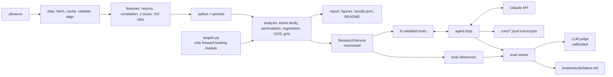

# Phase 5: Polish and Publish (v1.0)

Goal: a repo a recruiter can understand in 60 seconds and an engineer can run in 5 minutes.

Read first: `CLAUDE.md`, `docs/SPEC.md` section 14.

---

## Step 5.1: Final README

Rewrite `README.md` with these sections in order. Keep the generated-marker blocks exactly where they belong; `vixagent report` fills them.

````markdown
# VIX Research Agent

Do spikes in cross-asset correlation lead spikes in the VIX? A preregistered test on
2007 to 2026 market data, plus an LLM research agent that can only answer by calling
the tested pipeline, measured by a 24-case eval harness.


## Result
<!-- RESULTS:START -->
<!-- RESULTS:END -->

Full results: [reports/results.md](reports/results.md)

## Why this is hard
**Lookahead bias.** (2 to 3 sentences: what it is, the three safeguards, the truncation test.)

**Clustered events.** (2 to 3 sentences: declustering and circular-shift permutations.)

**Multiple testing.** (2 to 3 sentences: preregistration, the 24-combination grid, the overfitting check.)

## Architecture
```mermaid
(diagram from Step 5.2)
```

## Quickstart
```bash
git clone https://github.com/ajeetb123/vix-research-agent.git
cd vix-research-agent
python3.11 -m venv .venv && source .venv/bin/activate
pip install -e ".[dev]"
cp .env.example .env        # add your ANTHROPIC_API_KEY
vixagent pull               # download and cache data
vixagent report             # figures + results
vixagent chat --show-tools  # talk to the research agent
vixagent eval               # run the eval suite
```

## Example: the agent pushing back
(abridged transcript from Step 5.3)

## Eval results
<!-- EVALS:START -->
<!-- EVALS:END -->

What the evals do and do not test: (2 sentences from EVALS.md section 1.)

## Limitations
(bullets copied from the Limitations section of reports/results.md)

## What I learned
<!-- Written by Ajeet. -->

## Repository map
(short tree of the top-level folders with one line each)
````

Rules:
- No number anywhere in the README outside the generated blocks except in the Quickstart and the transcript (which is real output).
- The "What I learned" section contains only the HTML comment. The agent never writes it.

**Commit**: `docs: write final README structure`

---

## Step 5.2: Architecture diagram



Check it renders on GitHub (push and view the README).

**Commit**: `docs: add architecture diagram`

---

## Step 5.3: Example transcript

1. The human runs `vixagent chat --show-tools` and asks: "Correlation spikes predict VIX spikes most of the time, so this is basically a trading signal, right?"
2. Take the resulting `runs/*.jsonl` file. Produce an abridged version: user question, a one-line summary of each tool call (`run_event_study(risk, 21, z>=2.0, h=10, test, clean)`), and the final answer verbatim.
3. Paste into the README section. Do not edit the model's wording.

**Commit**: `docs: add real agent transcript example`

---

## Step 5.4 (optional): Streamlit demo

Only if the human says yes.

`app/streamlit_app.py`:
1. `st.set_page_config(page_title="VIX Research Agent", layout="wide")`.
2. Sidebar: data snapshot end, agent model, a "Clear chat" button, a "Show tool calls" checkbox.
3. Main area, two tabs:
   - **Chat**: `st.chat_message` history kept in `st.session_state["history"]` (the agent message list) and `st.session_state["display"]` (list of role/text pairs). On input, call `run_agent`; if "Show tool calls" is on, render each call in an `st.expander` with input and output JSON.
   - **Results**: the headline sentence and the four figures from `reports/figures/`.
4. Build the service once with `@st.cache_resource`.
5. On missing key or missing cache, show `st.error` with the fix, then `st.stop()`.

Run: `pip install -e ".[app]"` then `streamlit run app/streamlit_app.py`.

No unit tests required for the app, but it must pass `ruff check .` and `ruff format --check .`. Exclude `app/` from `mypy src` (it is already outside `src`).

**Commit**: `feat: add optional Streamlit demo`

---

## Step 5.5: Cleanup pass

1. `grep -rn "TODO\|FIXME\|XXX" src tests` returns nothing.
2. Every public function in `src/` has a docstring:
   ```bash
   python - <<'EOF'
   import ast, pathlib
   bad = []
   for p in pathlib.Path("src").rglob("*.py"):
       for n in ast.walk(ast.parse(p.read_text())):
           if isinstance(n, (ast.FunctionDef, ast.ClassDef)) and not n.name.startswith("_"):
               if ast.get_docstring(n) is None:
                   bad.append(f"{p}:{n.lineno} {n.name}")
   print("\n".join(bad) or "OK")
   EOF
   ```
   Prints `OK`.
3. No unused modules (anything in SPEC layout that ended up empty is either filled or removed with the human's approval).
4. `pip install -e ".[dev]"` in a brand-new venv still works.

**Commit**: `chore: final cleanup`

---

## Step 5.6: Fresh-clone check

In a temporary directory:
```bash
git clone https://github.com/ajeetb123/vix-research-agent.git /tmp/vra && cd /tmp/vra
python3.11 -m venv .venv && source .venv/bin/activate
pip install -e ".[dev]"
pytest -q
vixagent pull
vixagent report
```
All succeed. `git status` in the clone shows only regenerated files whose content is unchanged except `generated_at`.

---

## Step 5.7: Definition of Done, walkthrough, stop

Definition of Done passes; CI green on `main`.

Write `docs/walkthroughs/phase-5.md`: a single end-to-end trace of one question ("What is the headline result?") from the CLI through `run_agent`, `execute_tool`, `ResearchService`, `FrameStore`, `event_study_core`, back to the rendered answer, naming every function hit in order.

**Commit**: `docs: add phase 5 walkthrough`

**STOP.**

---

## Step 5.8: Human-only steps

1. Write "What I learned" yourself (5 to 8 sentences). Good material: what the null or positive result taught you, a bug the no-lookahead test caught, an eval failure and what fixed it, what you would do next.
2. Tag and release:
   ```bash
   git tag v1.0 && git push --tags
   gh release create v1.0 --title "v1.0" --notes "Preregistered correlation-VIX study, research agent, and eval harness."
   ```
3. Add repo topics on GitHub: `python`, `llm`, `agents`, `evals`, `quantitative-finance`, `statistics`.
4. Pin the repo on your GitHub profile. Add it to your portfolio site.
5. Update your resume bullet with the real numbers (template at the bottom of `docs/PLAN.md`).
6. Answer the Phase 5 Checkpoint Questions out loud, timed. Aim for the 60-second explanation without notes.
